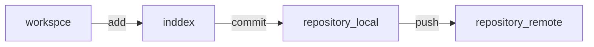

# Github

  
  
 git架構流程 

功能：
  1. 紀錄檔案更動情形，追蹤修改內容以及修改者
  2. 支援本地端與遠端版本控制
     

 Git Workflow 

* workspace：本機有的檔案
* index：暫存要提交的檔案，讓git可以追蹤檔案
* repository：儲存所有變更過的檔案以及專案個版本歷史紀錄(local / remote)

git常用指令  
- git clone
- git init： 初始化git repository

## 相關流程
### 初始化、相關設定
* git --version ：取的git版本
* git config --global user.name 'username' : 設定使用者名稱
* git config --global user.email 'user's email' :設定使用者email
* git config --list :查詢目前使用者名稱、email
* git init :初始化版本紀錄(git)

### 暫存資料
* git status：查詢更動內容
* git add filename：將有更動的檔案加入暫存
* git add .：將所有的更動加到暫存區
* git commit -m 'massage'：加入更動註解
* git log --(graph 圖像化/ pretty==oneline 單行呈現節點/ abbre-commit 縮短節電的待禡字元)：查詢版本提交紀錄

## resource
圖片
* https://medium.com/@talgoldfus/better-understanding-gits-work-flow-in-order-to-properly-deal-with-merge-conflicts-part-i-760a366fc997
### reference
英文
* https://medium.com/@talgoldfus/better-understanding-gits-work-flow-in-order-to-properly-deal-with-merge-conflicts-part-i-760a366fc997
中文
* https://weilihmen.medium.com/git-%E5%9F%BA%E6%9C%AC%E7%9F%A5%E8%AD%98-from-alpha-camp-5c9ef85cf825
